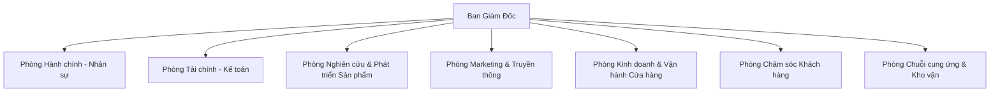

# CƠ CẤU TỔ CHỨC VÀ NHÂN SỰ CÔNG TY TNHH BASICCOLOR

## 1. Sơ đồ tổ chức

Công ty hoạt động theo mô hình trực tuyến chức năng, đảm bảo sự chuyên môn hóa cao nhưng vẫn giữ được tính linh hoạt.

## 2. Ban Lãnh Đạo & Nhân sự Tiêu biểu

### A. Ban Giám Đốc (Board of Directors)

#### 1. Chủ tịch kiêm Tổng Giám Đốc: Ông Nguyễn Doãn Đạt
*   **Sinh năm:** 1996
*   **Học vấn:** Cử nhân Quản trị Kinh doanh Đại học Ngoại Thương, Thạc sĩ Thời trang tại Istituto Marangoni (London).
*   **Tiểu sử:** Khởi nghiệp từ năm 22 tuổi với số vốn vỏn vẹn 50 triệu đồng. Ông Đạt đã chèo lái BasicColor vượt qua đại dịch Covid-19 và biến nguy cơ thành cơ hội để bứt phá trong mảng thương mại điện tử.
*   **Phong cách lãnh đạo:** Quyết đoán, coi trọng nhân tài và sự sáng tạo. Ông luôn khuyến khích nhân viên "Sai thì sửa, nhưng không được lặp lại lỗi cũ".
*   **Câu nói yêu thích:** "Fashion fades, only style remains the same" (Coco Chanel).

#### 2. Giám đốc Sáng tạo (Creative Director): Bà Lê Hạ Vy
*   **Sinh năm:** 1994
*   **Học vấn:** Tốt nghiệp xuất sắc London College of Fashion.
*   **Kinh nghiệm:** 8 năm kinh nghiệm, từng là Head Designer cho một thương hiệu Local Brand nổi tiếng trước khi đầu quân cho BasicColor.
*   **Dấu ấn:** Tác giả của bộ sưu tập "Minimalist Soul" - Best Seller 3 năm liên tiếp của công ty. Là người thổi hồn vào từng thiết kế, đảm bảo sự tinh tế trong từng đường kim mũi chỉ.

#### 3. Giám đốc Vận hành (COO): Ông Trần Minh Tuấn
*   **Sinh năm:** 1988
*   **Kinh nghiệm:** 15 năm kinh nghiệm trong ngành bán lẻ và chuỗi cung ứng.
*   **Vai trò:** "Người quản gia" của BasicColor, chịu trách nhiệm tối ưu hóa quy trình vận hành từ kho bãi đến cửa hàng, đảm bảo sản phẩm đến tay khách hàng nhanh nhất với chi phí thấp nhất.

#### 4. Giám đốc Marketing (CMO): Bà Phạm Ngọc Ánh
*   **Sinh năm:** 1998
*   **Phong cách:** Trẻ trung, năng động, nhạy bén với xu hướng Gen Z.
*   **Thành tích:** Kiến trúc sư trưởng của chiến dịch viral "Basic is the new Sexy" trên TikTok đạt 10 triệu view, đưa thương hiệu BasicColor đến gần hơn với giới trẻ.

#### 5. Giám đốc Công nghệ (CTO): Ông Ngô Văn Hùng
*   **Sinh năm:** 1992
*   **Vai trò:** Chịu trách nhiệm xây dựng nền tảng E-commerce và ứng dụng BasicColor App. Đang dẫn dắt dự án "Phòng thử đồ ảo" (Virtual Fitting Room) ứng dụng AI.

### B. Gương mặt Nhân viên Tiêu biểu

#### 1. Nguyễn Thị Mai - Cửa hàng trưởng BasicColor Phố Huế
*   **Thành tích:** "Best Store Manager" 2 năm liên tiếp (2022, 2023). Mai đã dẫn dắt cửa hàng Phố Huế luôn đạt 150% KPI doanh số mỗi tháng nhờ khả năng đào tạo nhân viên và chăm sóc khách hàng tuyệt vời.

#### 2. Trần Văn Nam - Tổ trưởng Tổ cắt may (Xưởng sản xuất)
*   **Thành tích:** "Đôi bàn tay vàng" của xưởng, với kinh nghiệm 20 năm trong nghề may mặc. Bác Nam là người trực tiếp kiểm soát chất lượng những mẫu rập đầu tiên, đảm bảo chuẩn form dáng trước khi đưa vào sản xuất đại trà.

## 3. Chức năng nhiệm vụ các phòng ban

1.  **Phòng R&D Sản phẩm:**
    *   Nghiên cứu xu hướng thời trang thế giới.
    *   Thiết kế mẫu mã sản phẩm mới theo mùa.
    *   Tìm kiếm và thử nghiệm chất liệu vải mới.

2.  **Phòng Kinh doanh:**
    *   Quản lý hệ thống cửa hàng bán lẻ.
    *   Phát triển kênh bán hàng Online (Website, Shopee, TikTok Shop...).
    *   Đào tạo đội ngũ nhân viên bán hàng.

3.  **Phòng Marketing:**
    *   Xây dựng chiến lược thương hiệu.
    *   Tổ chức các chiến dịch quảng bá hình ảnh.
    *   Quản lý các kênh truyền thông xã hội (Social Media).

4.  **Phòng Nhân sự:**
    *   Tuyển dụng và đào tạo nhân tài.
    *   Xây dựng văn hóa doanh nghiệp.
    *   Quản lý lương thưởng và các chế độ phúc lợi.

## 4. Chính sách Nhân sự và Phúc lợi

### Môi trường làm việc
*   **Năng động & Sáng tạo:** Văn phòng thiết kế mở, khuyến khích giao tiếp và chia sẻ ý tưởng.
*   **Flat hierarchy:** Mô hình quản lý phẳng, mọi nhân viên đều có quyền đóng góp ý kiến trực tiếp lên Ban Giám đốc.

### Chế độ đãi ngộ
*   **Lương thưởng cạnh tranh:** Review lương định kỳ 6 tháng/lần. Thưởng tháng lương thứ 13, thưởng KPI theo doanh số.
*   **Bảo hiểm sức khỏe:** Gói bảo hiểm sức khỏe cao cấp BasicCare cho nhân viên làm việc trên 1 năm.
*   **Nghỉ phép:** 12 ngày phép năm + 3 ngày "Mental Health Day".
*   **Ưu đãi nội bộ:** Giảm giá 50% khi mua sản phẩm của BasicColor cho nhân viên và người thân.

### Đào tạo và Phát triển
*   Tài trợ các khóa học chuyên môn ngắn hạn và dài hạn.
*   Chương trình "Future Leaders" dành cho các nhân sự trẻ tiềm năng được luân chuyển qua nhiều phòng ban để rèn luyện kỹ năng quản lý.

## 5. Văn hóa doanh nghiệp "BASIC"

*   **B - Bold (Dũng cảm):** Dám nghĩ dám làm, không ngại thử thách.
*   **A - Adaptive (Thích ứng):** Linh hoạt thay đổi để phù hợp với thị trường.
*   **S - Simple (Đơn giản):** Tư duy đơn giản hóa vấn đề để giải quyết hiệu quả.
*   **I - Integrity (Chính trực):** Luôn trung thực và giữ chữ tín.
*   **C - Customer-centric (Khách hàng là trọng tâm):** Mọi hành động đều hướng tới lợi ích khách hàng.
